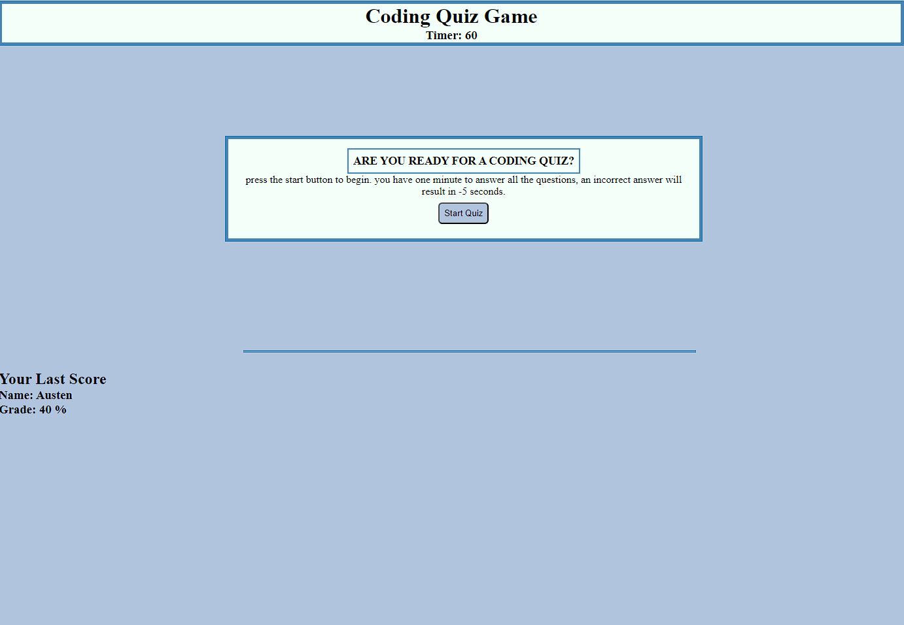

# Javascript Quiz App

## Description
A web app created to test your javascript knowledge! You'll have 60 seconds to answer all of the questions, upon completion your score will be logged to the browser local storage so you can keep track of your progess.

## Installation
n/a

## Usage
Press 'start quiz' - a timer will start and you'll be presented with your first question. The app will tell you whether your answer was correct or incorrect; each incorrect answer will result in a penalty of 5 seconds. At the end of the quiz you'll have a chance to log your score, which will be saved to the local storage to keep track of your progress each time you come back!

## Credits
N/A

## License

Please refer to the LICENSE in the repo.

---